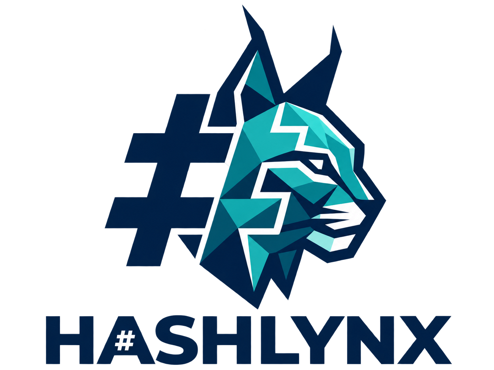

<p align="center"></p>

# HashLynx

A local Windows desktop workspace for **Hashcat**: inspect recovery targets, configure attacks, monitor jobs, and review results from one native WPF interface.

**Status: 0.1.0 — early functional bootstrap.** HashLynx orchestrates the official Hashcat executable; it does not implement a cracking engine. It is intended for legitimate password recovery, authorized security auditing, research, labs, and CTFs.

HashLynx is an independent GUI frontend. Hashcat is a separate third-party project, is not developed by HashLynx, and does not sponsor or endorse this application. Users must separately obtain and configure Hashcat. This repository and its publish output do not bundle it.

## What is implemented

- Native C#/.NET 10 WPF shell with MVVM, the supplied branding, a multi-size Windows icon, navy/teal styling, and Dark/Light/System preferences.
- **Target Inspector** with Paste Hash, Hash File, and Encrypted File inputs; file browsing and drag/drop; source/context selection; Hashcat identification; and a searchable manual mode catalog generated from the installed release.
- Dictionary, Mask, both Hybrid directions, and Combinator configurations. Dictionary attacks include original Quick, Normal, Heavy, and Super rule presets, an 848-word starter list, and clickable rule examples. Expert mode supports custom rule files and multiple wordlists.
- Mask/custom charset validation, increment settings, workload/device/temperature controls, named sessions, potfile/output options, and a constrained Expert argument extension field.
- Automatic validation when starting recovery, with run options, a copyable command preview, and a separate Preflight button in Expert mode. Commands execute with `ProcessStartInfo.ArgumentList`, never through a shell.
- Asynchronous jobs, parsed JSON status metrics, stop, job history, interrupted-job detection, and restore when a saved Hashcat restore file exists.
- Results associated with jobs, Hashcat `--show` integration, plaintext hide/reveal, copy, and export. Hardware discovery and refresh use Hashcat's backend information.
- An extensible extractor registry and manager for PDF, ZIP, RAR, 7-Zip, and BitLocker. Missing tools are shown as unavailable. Tool/interpreter locations are configurable and persisted.
- Attack profile save/load/delete, per-user JSON persistence with atomic writes, sanitized structured diagnostics, and a Windows build/test workflow.

## Target Inspector

Hashcat's `--identify` is the primary authority. A unique match is selected automatically; ambiguous matches are displayed for explicit selection. Fixed-length hexadecimal input can represent MD5, NTLM, and other algorithms, so length alone never establishes a certain type. Context is descriptive guidance and does not override the backend's candidates.

For hash files, a streaming scan counts total, blank, candidate, and problem lines, with bounded structural grouping and problem-line summaries. These structural checks do not prove that every line is a valid hash for the selected mode. The original file is never cleaned or modified in place.

Paste and extracted targets are saved as local working target files so child-process arguments do not need to contain the hash itself. Catalog parsing is isolated and cached by backend version. An older backend without optional identification or JSON-status support can still be configured; unsupported functionality produces a clear message.

## Requirements and setup

- Windows 10/11 with the **.NET 10 SDK** for development. A framework-dependent published application requires the .NET 10 Desktop Runtime.
- A complete official [Hashcat release](https://hashcat.net/hashcat/), obtained separately. A functioning compute backend/driver is required for actual recovery; merely listing a device does not guarantee that it can run a kernel.
- Optional external extractor tools and their required Python/Perl runtimes. HashLynx does not install or download these dependencies.

Clone and extract Hashcat into the exact layout below:

```powershell
git clone https://github.com/1ntrusi0n/HashLynx.git
cd HashLynx
# Download the official release yourself and extract its contents to .\hashcat\
```

```text
HashLynx/
  HashLynx.sln
  hashcat/
    hashcat.exe
    OpenCL/
    modules/
    rules/
    tools/
    ...the rest of the official release...
```

Keep the full release together. `hashcat/` is Git-ignored. HashLynx detects a development-tree `hashcat\hashcat.exe` and an application-adjacent `hashcat\hashcat.exe`. A manually configured directory overrides automatic discovery. If absent, the app opens Settings with a friendly setup message. Use **Detect Hashcat** or select the folder, then **Validate Hashcat**.

On Windows, Hashcat can create caches even during help/identification. HashLynx prepares a per-user backend workspace containing support assets and runs the configured original executable there. This protects the supplied release from cache/session writes. First validation needs time and disk space to copy support assets; later validations reuse that workspace. HashLynx does not download or replace Hashcat.

The workspace cache follows the executable's identity. If you update support assets without replacing the executable, close HashLynx and remove only `%LOCALAPPDATA%\HashLynx\cache\backend\` to rebuild it on the next validation. Never remove your original Hashcat release or job/results directories for this refresh.

## Build and run

```powershell
dotnet restore
dotnet build -c Release
dotnet test -c Release
dotnet run --project src/HashLynx.UI
```

Open the solution in Visual Studio or the repository folder in VS Code with C# support. The same commands work in VS Code's integrated terminal. The [Microsoft WPF documentation](https://learn.microsoft.com/en-us/dotnet/desktop/wpf/whats-new/net100) describes the .NET 10 platform used here.

To publish a framework-dependent x64 application:

```powershell
dotnet publish src/HashLynx.UI -c Release -r win-x64 --self-contained false -o artifacts/publish/win-x64
```

Or run `./scripts/build.ps1 -Publish`. Copy the publish directory as a unit. Obtain Hashcat separately and put its complete release alongside the application under `hashcat\`, or configure its existing location in Settings. Runtime dependencies are not silently installed.

## Recovery workflow

1. Add a pasted hash, hash file, or encrypted file in Target Inspector.
2. For a Dictionary attack, use the included starter wordlist or choose your own. Normal rules are selected by default.
3. Press **Start recovery**. HashLynx identifies the target when needed and checks the configuration automatically. If several hash modes match, choose the correct mode and press Start again.
4. Monitor the job on Jobs and refresh its Results after recovery.

Basic mode manages devices, session names, result paths, and other run settings. Enable **Expert mode** to select custom rule files, adjust run options, or use the separate Preflight and command-preview controls. Existing profiles with custom rules or advanced options open Expert mode so their saved behavior remains visible. Mask, Hybrid, and Combinator attacks remain available for users who need them.

### Built-in rules and wordlists

A wordlist supplies starting words; rules transform each word into password candidates. For example, the rule `c$1$!` turns `river` into `River1!`. Click **?** beside the rule preset for an explanation and more examples.

| Preset | Rules per word | Added coverage |
| --- | ---: | --- |
| Quick | 64 | Common case changes, short numbers, symbols, and substitutions |
| Normal (default) | 512 | Two-digit endings, years, and simple prefixes |
| Heavy | 4,096 | Three-digit endings, more combinations, and selected position changes |
| Super | 16,384 | Four-digit endings, broader prefixes, and paired substitutions |

Each tier contains the smaller tiers and uses one rule file. These are effort budgets, not measured recovery-rate rankings; candidates can coincide, and larger tiers take more work. With the 848-word starter list, Normal applies 434,176 rules in total. See [preset design and regeneration](docs/rule-presets.md).

The starter list is an original, small educational list embedded in the app (about 6 KB). A larger list appropriate to the target will often be more useful. **Choose wordlist** accepts your own local file. When `wordlist/HashLynx_Wordlist.txt` exists beside the app or in the development checkout, **Use local full list** selects it directly. The supplied combined list is about 506 MiB and 47.4 million lines; it stays local and is not copied into the repository or publish output. The root `rules/` and `wordlist/` source collections are Git-ignored.

The application never adds `--force`. Backend warnings and driver incompatibilities must be resolved normally. Expert arguments are restricted to an explicit set of additional options; they cannot replace managed target/mode/session/output settings or enable network features.

With the verified Hashcat 7.1.2 mappings, rule files apply to Dictionary; Hybrid and Combinator expose inline left/right rules. Dictionary loopback requires a rule file or preset. Expert custom rule files replace the preset; selecting several custom files causes Hashcat to combine their transformations multiplicatively. To run an unmodified dictionary in Expert mode, select custom rules and leave the file list empty. Expert arguments use one separated argument per line, for example `--runtime=60`; the preview remains read-only.

Pause/resume/checkpoint controls are disabled unless the backend's interactive transport is known to work. This Windows bootstrap does not claim verified console-key control through redirected pipes. **Stop** terminates the child process tree. Resume after exit is available only if Hashcat already wrote a usable restore file; stopping cannot guarantee a fresh checkpoint. Job history records completion, exhaustion, interruption, failure, and stop outcomes separately.

## Extractors

The manager shows every registered extractor and its dependency status. Configure executable or script paths and, for scripts, the interpreter. Validation checks tool availability; extraction is a separate explicit operation.

| Family | Adapter | Required separately |
| --- | --- | --- |
| PDF | External pdf2john | Compatible tool; Python or Perl if a script |
| ZIP | External zip2john | Compatible executable/tool |
| RAR | External rar2john | Compatible executable/tool |
| 7-Zip | External 7z2john | Compatible tool; interpreter if a script |
| BitLocker | Hashcat-supplied bitlocker2hashcat.py | Script in the configured release and Python 3 |

Header inspection and extension checks guide selection. Adapter results normalize supported John output into hash strings and feed the normal identification workflow. Suggested modes are hints, not a replacement for Hashcat identification. External tool output formats may differ by release; unsupported or failed output is diagnosed rather than presented as successful extraction.

BitLocker initially supports partition images recognized at offset zero with a user-password protector. TPM-only protectors, recovery-password cracking, and automatic whole-disk partition offset discovery are not implemented. See [extractor details](docs/extractors.md) for configuration, format support, and extension guidance. No John the Ripper source or binaries are redistributed.

## Privacy, data, and diagnostics

The application works locally/offline. It has no telemetry and does not upload hashes, recovered passwords, encrypted files, wordlists, or results. Configured external tools run locally with ordinary user permissions.

Mutable data lives under `%LOCALAPPDATA%\HashLynx\`:

| Location | Contents |
| --- | --- |
| `settings.json` | Paths and UI/default preferences |
| `profiles.json` | Saved attack configuration, without target contents or recovered results |
| `jobs.json` | Job configuration, lifecycle, exit codes, and status snapshots |
| `targets/` | Working copies of pasted/extracted targets |
| `jobs/` | Managed job/session state and fallback per-job outputs |
| `results/` | Default result files and potfile |
| `cache/` | Versioned mode catalog and backend support workspace |
| `rule-presets/` | Materialized, versioned built-in rule files |
| `wordlists/` | Materialized bundled starter wordlist |
| `logs/` | Sanitized JSON diagnostic events |

These files are **not encrypted by HashLynx**. Result files and potfiles contain recoverable credentials; hexadecimal output is encoding, not encryption. Protect them using your normal Windows account and disk controls. Data is retained for job recovery/history until you remove it. Review exports before sharing. Diagnostic logs exclude raw command lines, target values, recovered plaintext, and candidate data. Invalid saved JSON is preserved and reported rather than silently overwritten.

## Architecture

| Project | Responsibility |
| --- | --- |
| `src/HashLynx.UI` | WPF views, view models, navigation, themes, dialogs, application composition |
| `src/HashLynx.Core` | Domain/job/profile models, mask validation, streaming file inspection |
| `src/HashLynx.Hashcat` | Discovery/capabilities, command construction, preflight, process execution, status/catalog/device/result parsers |
| `src/HashLynx.Extractors` | `IHashExtractor`, registry, header inspection, external adapters, dependency checks |
| `src/HashLynx.Persistence` | Per-user paths, atomic JSON stores, structured logging |
| `tests/` | xUnit unit tests, opt-in backend integration checks, WPF smoke harness |
| `assets/branding` | PNG resources and multi-size ICO |
| `assets/wordlists` | Original bundled starter wordlist |
| `docs/`, `scripts/` | Integration notes and build/validation tools |

Attack family identifiers are strings; backend mode IDs are obtained from installed help and kept in the integration layer. Extractors are selected through a registry, allowing new formats without file-type logic in the GUI. There is no webview shell or network service.

## Validation and current limits

Normal tests and Windows CI need neither Hashcat nor a GPU. An optional installed-backend check exercises discovery, catalog, ambiguous identification, and `--show` using generated synthetic data:

```powershell
$env:HASHLYNX_TEST_HASHCAT = (Resolve-Path .\hashcat\hashcat.exe).Path
dotnet test tests/HashLynx.Integration.Tests -c Release --filter Category=Integration
```

This is an integration check, not a claim of recovery support on every driver. Initial local validation used Hashcat **v7.1.2**. The available Intel OpenCL driver was rejected by Hashcat, so successful GPU/CPU cracking and live interactive controls could not be validated on that machine. No warning-suppression flags were used. Real encrypted fixtures and a supported compute driver are still needed for a broader end-to-end matrix.

Run `dotnet run --project tests/HashLynx.UI.Smoke -c Release -- artifacts/ui-smoke` for isolated missing-backend startup, all page/template loading, attack/input/theme layouts, Basic/Expert control visibility, bundled content, legacy/custom profiles, populated manual-catalog expansion/selection/scrolling, and WPF binding checks. With `HASHLYNX_TEST_HASHCAT` set, it also checks catalog search, automatic validation, and preset command generation. Screenshots and the pass/fail report stay under the ignored artifacts directory. CI also runs this harness.

Status, ETA, temperatures, and device utilization are shown only when supplied by Hashcat. Candidate strings are deliberately omitted from persisted monitoring data to reduce secret duplication. Large result sets currently load into memory when refreshed; very large recovery outputs may need a future paged results viewer. File structural analysis is bounded and best-effort. The first release does not include installers, automatic updates, automatic dependency downloads, or new attack families beyond those listed above.

## Screenshots

Screenshot placeholder: capture the Attack, Jobs, and Extractors pages after configuring a local test installation. Use synthetic inputs and redact personal paths before adding screenshots to `docs/` or issues. The WPF smoke harness writes local screenshots under ignored `artifacts/` for review.

## License and contributions

HashLynx is licensed under [MIT](LICENSE). External software retains its own licenses; see [THIRD_PARTY_NOTICES.md](THIRD_PARTY_NOTICES.md). See [CONTRIBUTING.md](CONTRIBUTING.md), [AGENTS.md](AGENTS.md), and [CHANGELOG.md](CHANGELOG.md) for development expectations. Report vulnerabilities according to [SECURITY.md](SECURITY.md); never put real hashes/passwords/secrets in public issues.
